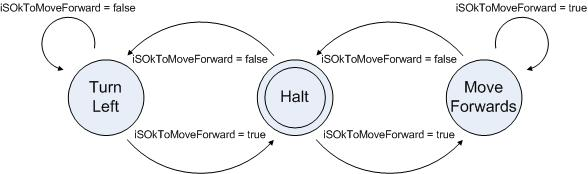

# Simple Robot Collision Avoidance Sketch

## Description

The robot will move around a room, avoiding obstacles using the Forwards Ultrasonic Sensor, as per the following state machine diagram:

## Unit Tests

The unit tests are controlled by the constant `RUN_UNIT_TESTS` which in turn applies conditional compilation using the preprocessing directives `#ifdef` `#ifndef` and `#endif`.  You either run the unit tests using `#define RUN_UNIT_TESTS` or you run the robot program.  You can not run both at the same time.  This is because the unit tests start to run after the first call to `moveRobot()` resulting in the failure of the first assertion in `test(ReadyToPingForward)`.  

Another issue with the unit tests is that you cannot predict the order that the tests will run.  For this reason, there are a number of assertions in `test(ReadyToPingForward)` to ensure the assertions are run in the correct order.

## Changes in Student version

Now compare this code with the repository https://github.com/SteveAmor/github_exercise_student to see the following issues:

1. Redundant code - "enum lunch {..." 
2. Poor indentation - "in isOkToMoveForwards()"
3. Function name with inconsistent case - "void LEFT(int speed)" 
4. Remove ; on unit test - "in test(returnPreviousForwardDistance).  Will compile until you #define RUN_UNIT_TESTS"
5. Constant in lower case - "Forward_Min_Distance"
6. Using magic numbers - "150 used in moveRobot() instead of MOTOR_SPEED"
7. Unnecessary comments - "in moveRobot() - which is now FSM()"
8. Poor function naming - "renamed moveRobot() to FSM()"
9. Spelling mistake in README.md - "The robert will move around a room ..."
10. Redundant syntax - "unnessary brackets after return statements"
11. Redundant/duplicate code - "no need for first return statement in sonicForwardDistance() just falls through to same return statement" 
12. Readability - "no spaces between operators in isOkToMoveFowards()"
